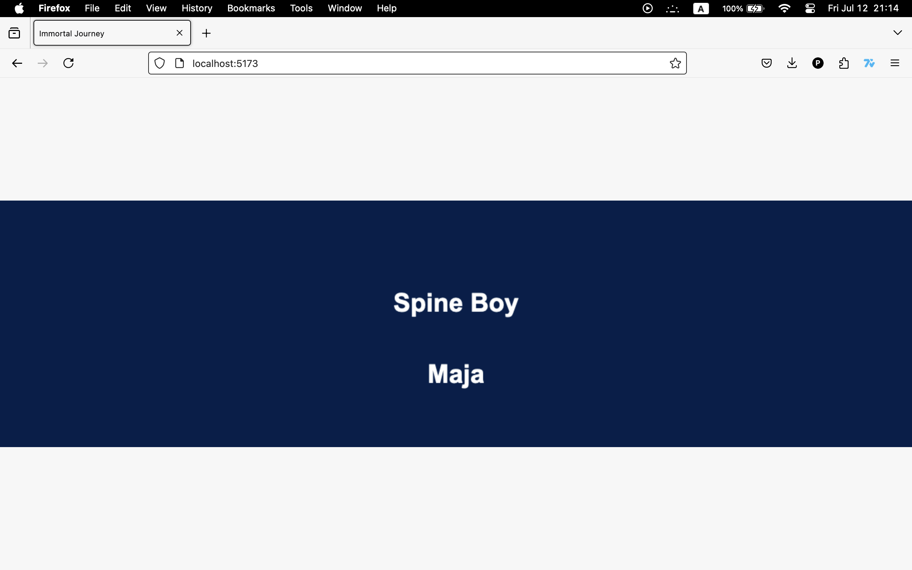
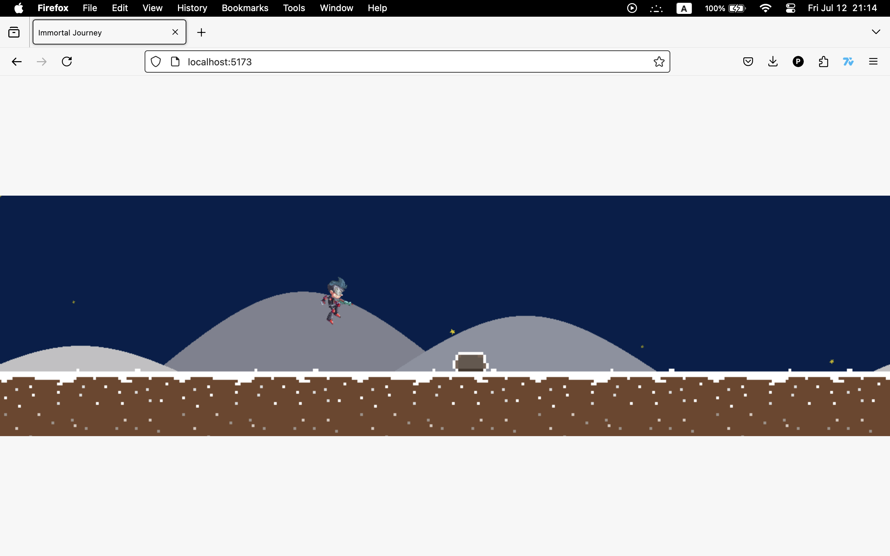
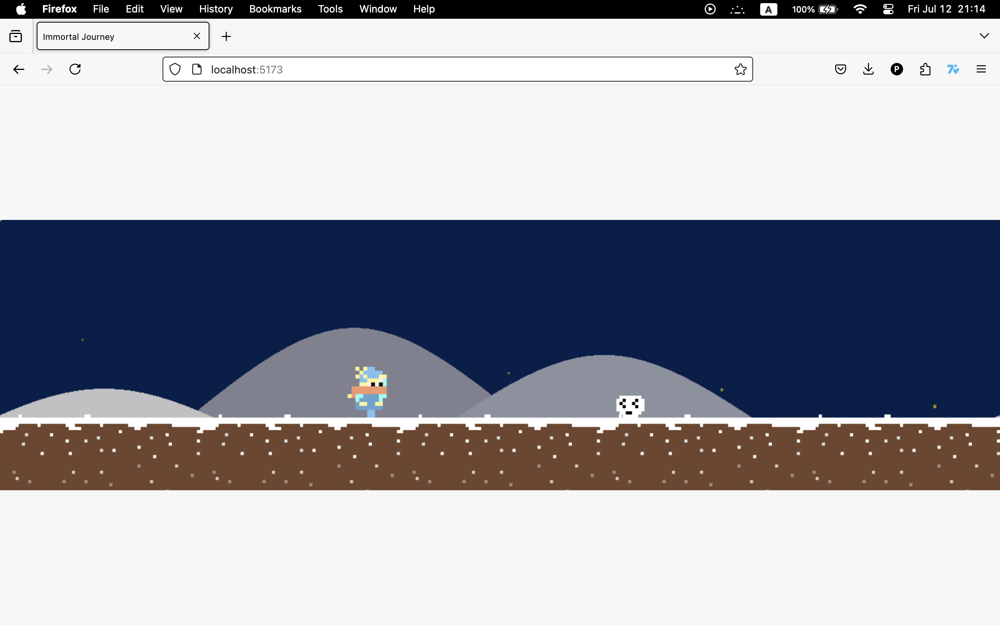
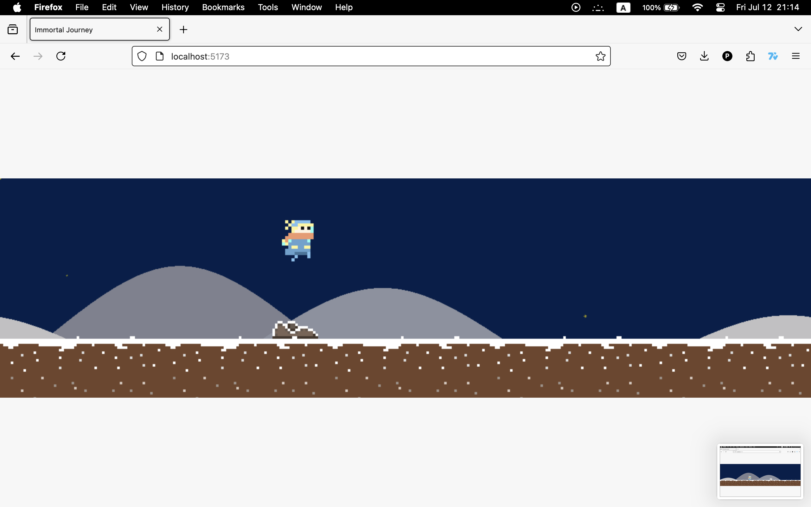
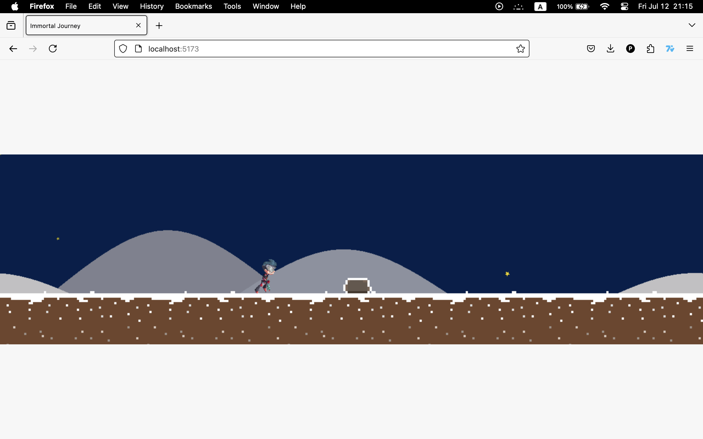

# Immortal Journey

This is a web-based game built using Vite, Vanilla TypeScript, PixiJS, and Pixi-Spine. The game features pixel art and a Spine character. Players can choose between two characters, "Spine Boy" and "Maja", and navigate through a running game where they must dodge obstacles.

## Table of Contents

- [Features](#features)
- [Installation](#installation)
- [Usage](#usage)
- [Screenshots](#screenshots)
- [Credits](#credits)
- [License](#license)

## Features

- **Character Selection**: Choose between "Spine Boy" (a Spine character) and "Maja" (a pixel art character).
- **Gameplay**: Run and jump to dodge obstacles.
- **Graphics**: Combines pixel art and Spine animation.

## Installation

To get started with the project, follow these steps:

1. Clone the repository:
    ```sh
    git clone https://github.com/pouriaafshari/Immortal-journey.git
    ```
2. Navigate to the project directory:
    ```sh
    cd your-repo-name
    ```
3. Install the dependencies:
    ```sh
    npm install
    ```
4. Start the development server:
    ```sh
    npm run dev
    ```

## Usage

Once the development server is running, open your web browser and go to `http://localhost:5173` to play the game.

### Controls

- **Jump**: Press the spacebar to jump and dodge obstacles.

## Screenshots

Here are some screenshots of the game:

1. 
2. 
3. 
4. 
5. 

## Credits

- **Spine Boy**: The Spine character "Spine Boy" was downloaded from the official Spine website as an example model.
- **Maja**: The pixel art character "Maja" was created by me.

## License

This project is licensed under the MIT License. See the [LICENSE](./LICENSE) file for details.
